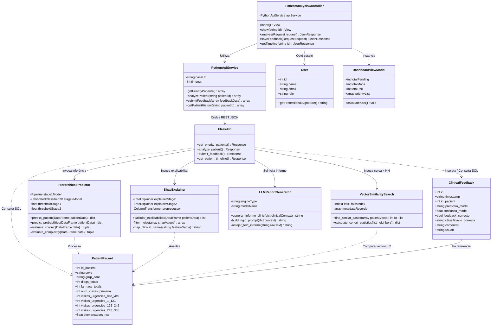
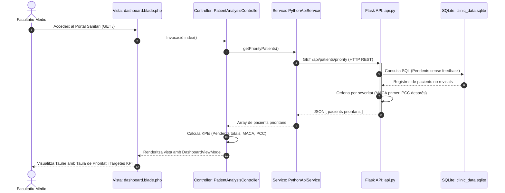
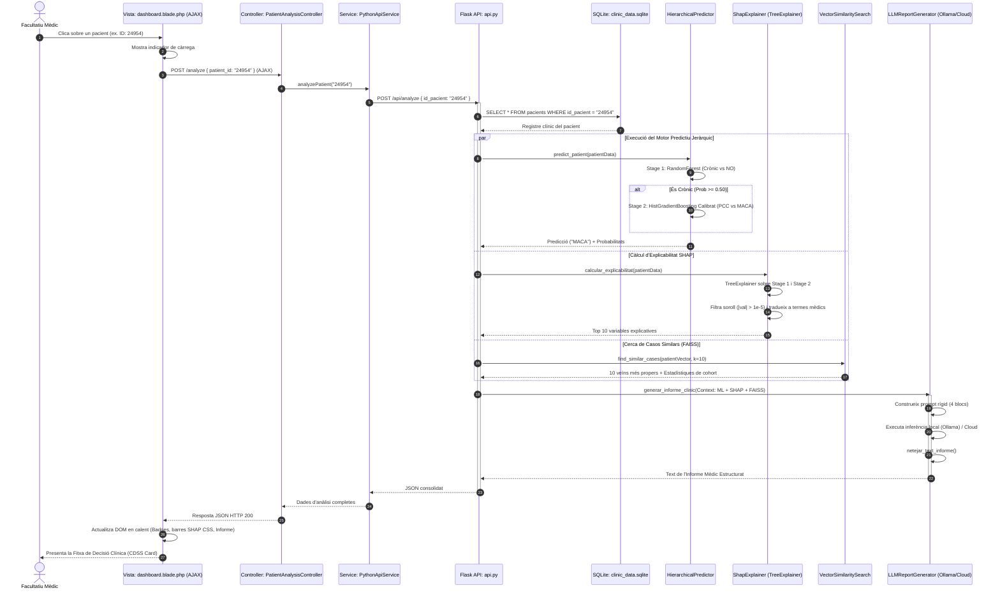
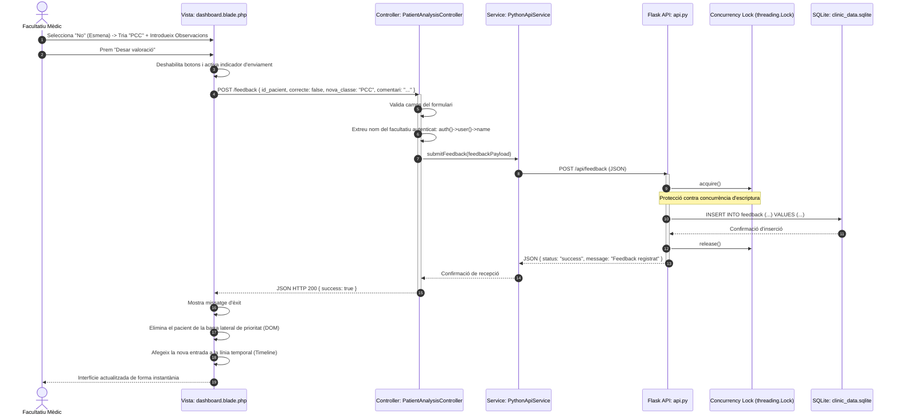
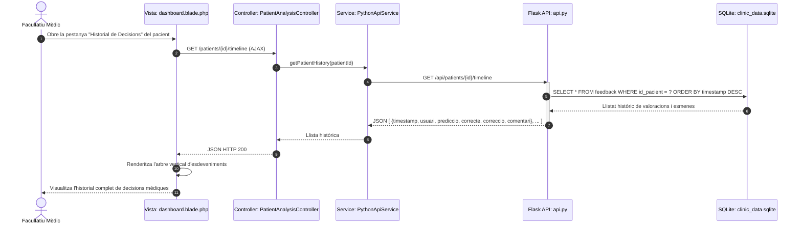
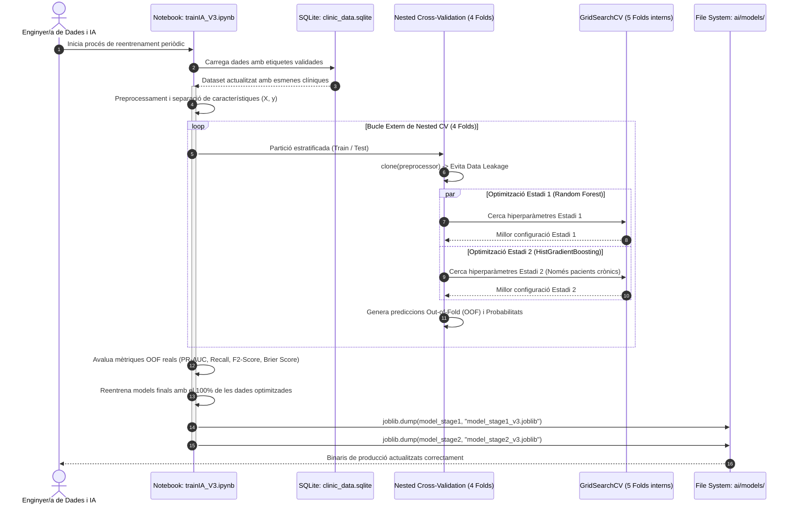
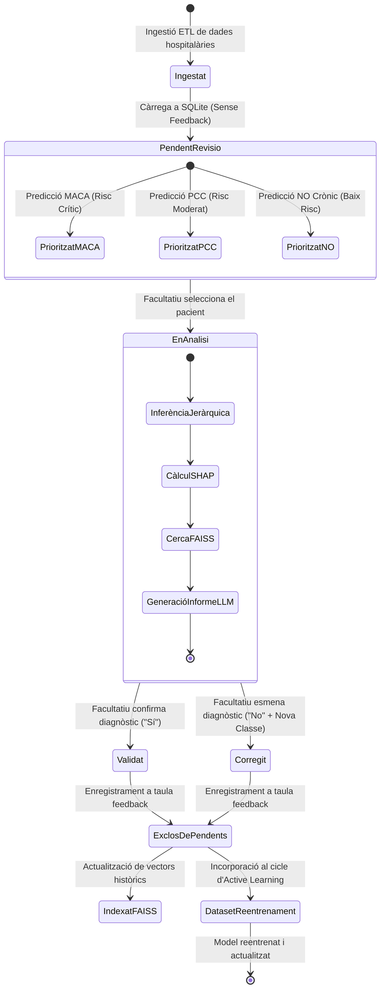

# Capítol 6: Anàlisi dels Requisits Funcionals

Aquest document conté l'**anàlisi formal dels requisits funcionals** del sistema per a la redacció del **Capítol 6** de la memòria del Treball de Fi de Grau (TFG). Inclou el **Diagrama de Classes del Sistema**, l'anàlisi del model de domini i els **Diagrames de Seqüència UML** per a cadascun dels casos d'ús principals.

---

## 6.1. Diagrama de Classes del Sistema

El sistema s'estructura seguint un patró arquitectònic desacoblat en tres capes (**Presentació/Control en Laravel**, **Serveis d'Intel·ligència Artificial en Python Flask** i **Persistència de Dades en SQLite/FAISS**).

### 6.1.1. Diagrama de Classes UML (Mermaid)

---

### 6.1.2. Descripció dels Components i Classes Principals

#### 1. Capa de Presentació i Control (Laravel)
* **`PatientAnalysisController`**: Controlador principal de la interfície d'usuari. Rep les peticions del navegador web, valida les entrades, invoca el servei `PythonApiService` i injecta les dades a les vistes Blade (`dashboard.blade.php`). Gestiona el flux asíncron (AJAX) d'anàlisi i tramesa de valoracions mèdiques.
* **`PythonApiService`**: Servei d'abstracció HTTP basat en `Illuminate\Support\Facades\Http`. Centralitza la configuració d'adreces de xarxa, capçaleres, gestió de timeouts i serialització/deserialització del format JSON cap a l'API de Python.
* **`User`**: Model d'usuari autenticat a Laravel. Aporta la identitat del facultatiu mèdic (`name`, `role`) per a la traçabilitat clínica obligatòria de les esmenes de diagnòstic.
* **`DashboardViewModel`**: Classe/Estructura de dades de vista que agrega els indicadors clau de rendiment hospitalari (KPIs: pendents totals, alertes MACA, alertes PCC) i la llista de pacients prioritzats.

#### 2. Capa d'Intel·ligència Artificial i Suport a la Decisió (Flask / Python)
* **`FlaskAPI`**: Punt d'entrada de la capa d'IA (`api.py`). Exposa els punts d'accés REST (`/api/patients/priority`, `/api/analyze`, `/api/feedback`, `/api/timeline`), orquestrant els mòduls de càlcul de forma sincronitzada.
* **`HierarchicalPredictor`**: Motor d'aprenentatge automàtic jeràrquic. Executa de manera seqüencial el model d'Estadi 1 (`RandomForestClassifier` per a cronicitat $\ge 0.50$) i l'Estadi 2 (`HistGradientBoostingClassifier` calibrat per a PCC vs. MACA $\ge 0.40$), retornant les probabilitats calibrades de cada classe.
* **`ShapExplainer`**: Mòdul d'explicabilitat basat en SHAP. Executa `TreeExplainer` de forma nativa sobre els arbres de decisió dels models de scikit-learn, filtra el soroll numèric ($|val| > 10^{-5}$) i mapeja els noms tècnics de les columnes a nomenclatura clínica en català.
* **`VectorSimilaritySearch`**: Motor de cerca semàntica i recuperació de casos anàlegs. Utilitza un índex vectorial **FAISS** (`IndexFlatIP` normalitzat amb norma L2) per trobar en pocs mil·lisegons els $k=10$ pacients històrics més semblants al cas actual, extraient estadístiques d'evolució clínica.
* **`LLMReportGenerator`**: Mòdul generador d'informes mèdics (`ollama.py`). Construeix un prompt rígid estructurat en 4 blocs a partir de les dades de ML, SHAP i FAISS, i el transmet a un motor d'inferència local (Ollama amb Gemma/Llama) o al núvol (OpenRouter), aplicant posteriorment regles de neteja textual (*post-processing*).

#### 3. Capa de Dades i Entitats (SQLite)
* **`PatientRecord`**: Representa l'estructura relacional d'un pacient a la base de dades `clinic_data.sqlite` (taula `pacients`), amb índex sobre `id_pacient`. Conté dades demogràfiques, biomarcadors de laboratori, diagnòstics totals, fàrmacs i visites estructurades en 3 finestres temporals.
* **`ClinicalFeedback`**: Entitat de persistència que emmagatzema les decisions dels metges a la taula `feedback`. Enregistra la marca de temps, el pacient analitzat, la predicció de la IA, la conformitat o esmena, el diagnòstic corregit, les observacions textuals i el metge autor.

---

## 6.2. Diagrames de Seqüència dels Casos d'Ús (UML)

A continuació es presenten els diagrames de seqüència detallats que modelen la interacció dinàmica dels objectes per a cadascun dels casos d'ús del sistema.

---

### 6.2.1. DS-01: Consultar la llista de pacients prioritzats (CU-01)

Aquest diagrama descriu el procés mitjançant el qual el facultatiu accedeix al portal mèdic i el sistema recupera i renderitza la llista de pacients pendents de revisió ordenats per severitat clínica.

---

### 6.2.2. DS-02: Analitzar un pacient i consultar el suport a la decisió CDSS (CU-02)

Aquest diagrama reflecteix el flux unificat d'alta eficiència on, en una única sol·licitud asíncrona, s'executa el motor de Machine Learning jeràrquic, l'explicabilitat SHAP, la cerca FAISS i la generació de l'informe clínic assistit per LLM.

---

### 6.2.3. DS-03: Registrar feedback clínic (Validar o Corregir diagnòstic) (CU-03)

Aquest diagrama detalla el cicle de retroalimentació mèdica (*Active Learning*), il·lustrant com la decisió s'enregistra de forma atòmica a la base de dades i provoca l'exclusió automàtica del pacient de la llista de pendents sense recarregar la pàgina.

---

### 6.2.4. DS-04: Consultar l'historial de decisions clíniques (*Timeline*) (CU-04)

Aquest diagrama descriu la consulta de la traçabilitat clínica i l'historial d'esmenes realitzades prèviament sobre un pacient.

---

### 6.2.5. DS-05: Executar reentrenament dels models (*Active Learning*) (CU-05)

Aquest diagrama il·lustra el cicle d'enginyeria de dades i aprenentatge actiu, on les valoracions clíniques acumulades s'utilitzen per reajustar i calibrar els models predictius.

---

## 6.3. Diagrama de Transició d'Estats del Pacient (State Machine)

Com a complement de l'anàlisi dinàmica, el següent diagrama descriu els canvis d'estat d'un registre de pacient al llarg del flux assistencial i d'intel·ligència artificial:

