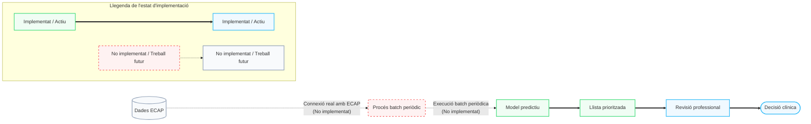

# Projecte SIA - Sistema de Suport a la Decisió Clínica (CDSS)
SIA (**Salut en Intel·ligència Artificial**) és una eina dissenyada per a l'Hospital Universitari Joan XXIII com a sistema de suport a la decisió clínica (CDSS). El projecte original va néixer com una solució de hackató per classificar pacients crònics i oferir-los consells personalitzats. En aquesta versió actual, el projecte s'ha extès i evolucionat completament cap a una plataforma de recerca i validació clínica que incorpora tècniques d'explicabilitat (SHAP), aprenentatge actiu per retroalimentació (feedback), base de dades SQL indexada, i una integració de LLM local o al núvol de gran robustesa.

## Entitat del repte
Hospital Universitari Joan XXIII

---

## Autoria i Historial del Projecte

El desenvolupament d'aquest projecte s'ha dividit en dues grans fases:

### 1. Projecte Original (Fase Inicial / Hackató - Equip TarrIAco)
El nucli conceptual de SIA i el portal web inicial van ser desenvolupats col·laborativament pel grup **TarrIAco**. Tota la informació original descrita en les primeres versions d'aquest fitxer correspon a la feina realitzada per:
* **Genís Aragonés Torralbo** (genisarato@gmail.com | [Github](https://github.com/Genisarato))
* **Marc Roda Cortés** (1516marcroda@gmail.com | [Github](https://github.com/Marc-yes))
* **Massin Laaouaj** (massin.laaouaj@estudiants.urv.cat | [Github](https://github.com/massinlaaouaj))
* **David Quintana Palomar** (dqp220504@gmail.com | [Github](https://github.com/Quintana-04))

### 2. Extensió, Refactorització i Estat Actual (Treball de Fi de Grau)
Totes les millores arquitectòniques, el disseny experimental, el mòdul d'explicabilitat, el motor de retroalimentació actiu, l'optimització de persistència a SQLite, el "traductor clínic" LLM i l'entorn de producció multi-contenidor Docker han estat realitzats **exclusivament de forma individual per Marc Roda Cortés** com a part del seu **Treball de Fi de Grau (TFG)**.

---

## Evolució i Millores Implementades al TFG

El projecte s'ha dotat de les següents funcionalitats i característiques tècniques per passar d'un prototip conceptual de hackató a un sistema avaluador de gran estabilitat:

### 1. Validació de Models de Referència i Nested Cross-Validation
* **Nested Cross-Validation**: S'ha implementat una validació encreuada nidada (Nested CV) exterior de 4 folds amb un GridSearchCV intern de 5 folds a [trainIA_V3.ipynb](file:///c:/Users/1516m/Desktop/UNI/GEI/4t/2Q/TFG/Codi_Projecte/ai/trainIA_V3.ipynb) per optimitzar els hiperparàmetres de forma robusta i evitar el *data leakage*.
* **Mètriques Out-of-Fold (OOF)**: S'avaluen de forma rigorosa mètriques de Recall, PR-AUC, Precisió, F2-Score, Brier Score, Corbes de Calibratge de probabilitat i la Matriu de Confusió.
* **Baselines**: S'han incorporat com a models de comparació el `DummyClassifier` (estratègies *prior* i *stratified*) i un model de `LogisticRegression` amb pesos balancejats per validar la millora del pipeline predictiu jeràrquic.

### 2. Mòdul d'Explicabilitat Local i Global (SHAP)
* **Càlcul local a l'API**: S'ha integrat la llibreria `SHAP` (SHapley Additive exPlanations) mitjançant un explicador d'arbre (`TreeExplainer`) que calcula en calent les 10 variables amb més pes en la classificació de cada pacient (Estat 1: Crònic vs NO; Estat 2: PCC vs MACA).
* **Interfície Visual del Metge**: A [dashboard.blade.php](file:///c:/Users/1516m/Desktop/UNI/GEI/4t/2Q/TFG/Codi_Projecte/portal-sanitari/resources/views/dashboard.blade.php), el portal web tradueix els codis tècnics de les variables a descriptors clínics en català i renderitza gràfics de barres progressives dinàmiques per colors segons el sentit de la contribució.

### 3. Mecanisme de Feedback (Active Learning)
* **Formulari de Retroalimentació**: S'ha afegit un formulari AJAX a la targeta del metge per validar si la predicció del model és correcta. Si no ho és, el facultatiu pot proposar la classificació real (NO / PCC / MACA) i afegir observacions clíniques.
* **Seguretat i Concurrència**: Les dades de feedback inclouen l'usuari autenticat de Laravel de forma transparent. Al backend de Python Flask, s'implementa un fil de bloqueig (`threading.Lock`) per garantir escriptures concurrents atòmiques i segures a la base de dades.

### 4. Gestió d'Estats i Línia de Temps Clínica
* **Estats Dinàmics**: Cada pacient rebrà un estat de revisió calculat en calent: **Pendent** (sense acció), **Validada** (correcta) o **Corregida** (el metge ha triat una altra etiqueta).
* **Timeline Interactiu**: El metge disposa d'un panell lateral de línia de temps que recupera l'historial complet de decisions registrades per a aquell pacient (data, autor, tipus de correcció i comentaris de justificació).

### 5. Optimització de la Persistència a SQLite
* **Desacoblament d'ETL**: S'ha separat la fase d'enginyeria de característiques que produeix el CSV d'entrenament, del funcionament de l'aplicació.
* **Base de Dades Indexada**: Mitjançant un script de migració (`migrate_csv_to_sqlite.py`), es carreguen les dades clíniques a una base de dades SQLite (`clinic_data.sqlite`). Les consultes de l'API de Python Flask es realitzen on-demand utilitzant SQL indexat en lloc de carregar els fitxers CSV en memòria, disminuint el temps de recuperació de dades a **menys de 2 mil·lisegons** i reduint dràsticament l'ús de RAM.

### 6. "Traductor Clínic" de SHAP amb IA (LLM Hybrid System)
* **Integració de SHAP al prompt**: L'API de Python Flask envia al LLM els factors de decisió del SHAP ja traduïts per a que el model redacti un informe clínic estructurat amb recomanacions d'acció adaptades (ex. revisar fàrmacs en cas de polifarmàcia).
* **Arquitectura Híbrida**: Permet triar entre utilitzar **OpenRouter** (per a models en el núvol com Llama-3 o Qwen-2.5) i **Ollama local** (per a models privats on-premises com Gemma3 o Llama-3.2, garantint que les dades de salut no surten de l'hospital) configurant el fitxer `.env`. S'inclou un sistema de fallback automàtic a local si falla l'API del núvol.
* **Seguretat en la Renderització**: S'aplica un procés de neteja textual per evitar notes conversacionals del LLM, i a Laravel Blade es parsegen els marcadors de negreta (`**`) de forma segura contra atacs XSS.

---

## Arquitectura del Sistema Implementat

```
          ┌──────────────────────────────────────────────────────────────┐
          │                    PORTAL WEB SANITARI                       │
          │                   (Laravel – PHP/Blade)                      │
          │   [Vista Metge: CDSS + Timeline]  [Vista Pacient: Consells]  │
          └──────────────────────────────┬───────────────────────────────┘
                                         │ HTTP REST (JSON)
                                         ▼
          ┌──────────────────────────────────────────────────────────────┐
          │                    API FLASK (Python)                        │
          │       /api/analyze                   /api/feedback           │
          │                                                              │
          │   ┌────────────────────────┐       ┌──────────────────────┐  │
          │   │  Preprocessador &      │       │ Base de Dades        │  │
          │   │  Models Stage 1 i 2    │       │ SQLite Local         │  │
          │   └───────────┬────────────┘       │ (clinic_data.sqlite) │  │
          │               │                    └──────────┬───────────┘  │
          │               ▼                               │              │
          │   ┌────────────────────────┐                  │              │
          │   │ TreeExplainer (SHAP)   │◄─────────────────┤ (SQL query   │
          │   └───────────┬────────────┘                  │  < 2ms)      │
          │               │                               │              │
          │               ▼                               │              │
          │   ┌────────────────────────┐                  │              │
          │   │ LLM (OpenRouter /      │                  │              │
          │   │  Ollama Local Fallback)◄──────────────────┘              │
          │   └────────────────────────┘                                 │
          └──────────────────────────────────────────────────────────────┘
```

---

## Tecnologies Utilitzades

* **Llenguatges de programació**: Python 3.11+, PHP 8.2 (Laravel), JavaScript (ES6+), Blade templates i SQL.
* **Frameworks i Llibreries**:
  * **Scikit-learn**: RandomForestClassifier, HistGradientBoostingClassifier, CalibratedClassifierCV, i pipelines de preprocessament.
  * **SHAP**: Explicabilitat local i global basada en valors Shapley.
  * **FAISS (faiss-cpu)**: Indexador de similitud vectorial per a la cerca dels 10 pacients més semblants.
  * **Flask**: API REST per exposar el backend de Machine Learning i servei de LLM.
  * **Laravel 11**: Portal de gestió amb autenticació de metges i accés personalitzat per a pacients.
* **Persistència i Eines**:
  * **SQLite**: Base de dades relacional d'inferència clínica i històric de feedback.
  * **Ollama & OpenRouter**: Proveïdors del model d'informes (Llama 3.1, Gemma 3, Qwen).
  * **Docker / Docker Compose**: Desplegament on-premises mitjançant una arquitectura multi-contenidor.

---

## Llicència

* **Projecte Original**: Llicenciat sota els termes de la llicència **Apache License 2.0**.
* **Extensió i Codi Actual (TFG)**: Totes les modificacions, ampliacions i components nous desenvolupats per Marc Roda Cortés es distribueixen també sota la mateixa llicència **Apache License 2.0**.

---

## Opcions de Desplegament

### OPCIÓ A: Entorn de Desenvolupament Local (amb Laravel Herd)

Per a programar o provar l'entorn de desenvolupament local directament a Windows amb Laravel Herd:

1. **Dependències**:
   * A `portal-sanitari/` executa `composer install` i `npm install`.
2. **Configuració**:
   * Copia `.env.example` a `.env` i genera la clau amb `php artisan key:generate`.
   * Configura al `.env` la connexió de base de dades SQLite:
     ```env
     DB_CONNECTION=sqlite
     ```
   * Corre les migracions: `php artisan migrate`.
3. **Servir**:
   * Enllaça la carpeta a Herd executant `herd link` a `portal-sanitari/`. Això farà accessible la web a **`http://portal-sanitari.test`**.
4. **Assets**:
   * Compila el disseny estàtic un cop executant `npm run build`.

---

### OPCIÓ B: Entorn de Producció Local (amb Docker Compose)

Per a desplegaments en un servidor on-premises de l'hospital sense dependències externes de software i garantint que les dades queden a la intranet local:

1. **Aixecar el Clúster de Contenidors**:
   Des de l'arrel de `Codi_Projecte/` on es troba el fitxer `docker-compose.yml`, executa:
   ```bash
   docker compose up -d --build
   ```
2. **Serveis que s'inicien**:
   * `ollama-service`: Servidor oficial de models de llenguatge Ollama.
   * `ollama-pull`: Contenidor auxiliar que descarrega de forma asíncrona el model desitjat (ex. `gemma3:1b` o `llama3.2:3b`).
   * `ai-api`: API de Python Flask que encapsula els models d'arbres de decisió, FAISS, SHAP i la connexió SQL a `clinic_data.sqlite`.
   * `portal-sanitari`: Servidor Apache amb PHP que munta l'entorn Laravel ja compilat en multi-etapa (Node + Composer).

La web passarà a estar directament accessible al port publicat en la configuració del contenidor o a `http://localhost`.

---

## Usuaris de Prova i Accés

### 1. Portal dels Professionals (Metges)
* **Login URL**: `http://portal-sanitari.test/login` (o el port del contenidor a localhost)
* **Username**: `admin` *(o email `admin@hospital.cat`)*
* **Password**: `admin`

### 2. Portal del Pacient (El Meu Espai de Salut)
* **Login URL**: `http://portal-sanitari.test/pacient/login`
* **ID de Pacient (DNI/Codi)**: Qualsevol identificador del dataset. Exemples: `24954` o `22644`.
* **Password**: *No es requereix* (login simulat mitjançant identificador de pacient per a demostracions).


